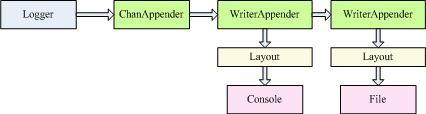

# glog
go log is a logger for go 

# star it && QQ群：869428810

# Features
1. 输出到控制台
2. 输出到文件
3. 输出到切分文件
4. 输出格式内容定制
5. 异步、线程安全
6. 基于配置文件
7. 日志过滤
8. 输出目标插件、输出格式插件、过滤插件

# 日志处理流程

1. 每个logger由多个appender组成
2. appender以职责链的方式工作，可以存在1个以上
3. ChanAppender可以使日志以异步的方式工作
4. WriterAppender可以把日志写出到Writer中
5. Layout决定了日志的输出格式和输出内容
6. Writer决定日志输出到哪里，可以是文件或控制台

### Writer
writer决定了日志的输出目标, 配置文件中有一个专门的块用于配置writers
```
  "writers" : {
    "fileWriterName":{
      "writer":"file",
      "path":"slog/log.log"
    },
    "consoleWriterName":{
      "writer":"console"
    },
    "sfiledevWriterName":{
      "writer":"sfile",
      "path":"slog/logdev.log",
      "span":"1m"
    },
    "sfilepubWriterName":{
      "writer":"sfile",
      "path":"slog/logpub.log",
      "span":"1m"
    }
  }
```
console ：输出到控制台
```
    "consoleWriterName":{   //consoleWriterName是wirter的名字，appender通过这个名字找到writer
      "writer":"console"    // 表示这是一个console类型的writer
    },
```  
file：输出到文件
```
    "fileWriterName":{          // fileWriterName是wirter的名字，appender通过这个名字找到writer
          "writer":"file",      // 表示这是一个file类型的writer
          "path":"slog/log.log" // 输出的目标文件名
    },
```
sfile：输出到文件，文件以时间段进行切分
```
    "sfiledevWriterName":{      // sfiledevWriterName是wirter的名字，appender通过这个名字找到writer
      "writer":"sfile",         // 表示这是一个sfile类型的writer
      "path":"slog/logdev.log", // 输出的目标文件名
      "span":"1m"               // 文件切分的间隔，1s表示1秒，1m表示1分，1h表示1小时，1d表示1天，7h表示7小时，600m表示600分钟
    },
```
discard：丢弃
```
    "discardWriterName":{
      "writer":"discard"
    },
```
我们可以通过实现接口io.Writer定义自己的writer

### appenders
日志的输出方式输出格式等，配置在appenders块中
```
"appenders" : {
    "discardAppenderName" : {
      "appender":"writer",
      "params": {
        "writer":"discardWriterName"
      },
      "filters": {
        "level.limit": {"level": "debug"}
      },
      "layout": "[{logger}] [goid:{goid}] {date:2006-01-02 15:04:05} [{level}] {body} {fields} {file::,short}"
    },
    "consoleAppenderName" : {
      "appender":"writer",
      "params": {
        "writer":"consoleWriterName"
      },
      "filters": {
        "level.limit": {"level": "debug"}
      },
      "layout": "[{logger}] [goid:{goid}] {date:2006-01-02 15:04:05} [{level}] {body} {fields} {file::,short}"
    },
    "sfiledevAppenderName" : {
      "appender":"writer",
      "params": {
        "writer":"sfiledevWriterName"
      },
      "filters": {
        "level.limit": {"level": "debug"}
      },
      "layout": "[goid:{goid}] {date:2006-01-02 15:04:05} [{level}] {body} {fields} {file::,full}"
    },
    "sfilepubAppenderName" : {
      "appender":"writer",
      "params": {
        "writer":"sfilepubWriterName"
      },
      "filters": {
        "level.limit": {"level": "warn"}
      },
      "layout": "[goid:{goid}] {date:2006-01-02 15:04:05} [{level}] {body} {fields} {file::,full}"
    }
  }
```
### chanappender
以chan实现的异步日志功能
```
    "async" : {             // appender的名字，logger通过这个名字找到appender
      "appender":"chan",    // 表示这个appender是chan类型，实现异步日志功能
      "param": {
        "cap": 1024         // chan的容量
      }
    }
```

### writerappender
以配置的layout向目标writer输出日志
```
    "consoleAppenderName" : {       // appender的名字，logger通过这个名字找到appender
      "appender":"writer",          // 表示这个appender是writer类型，可以向writer输出日志
      "params": {
        "writer":"consoleWriterName"// writer的名字，这个名字必须在writers配置中存在
      },
      // 输出日志的格式，由element组成
      "layout": "[{logger}] [goid:{goid}] {date:2006-01-02 15:04:05} [{level}] {body} {fields} {file::,short}"
    },
```
appender可以自定义

### layout
日志输出格式内容，存在于appender配置中
```
"layout": "[{logger}] [goid:{goid}] {date:2006-01-02 15:04:05} [{level}] {body} {fields} {file::,short}"
```
layout中由{}扩起来的是element，会在日志中替换为对应的element，其它内容会原样输出

### element
layout中的单元，可以输出一些特殊信息  
body:日志的主体  
date:系统时间  
level:日志级别  
fields:结构化日志项  
file:日志所在的函数、文件、文件行号（比较耗费性能）  
goid:go程的id(非常耗费性能）  
logger:logger的名字  
element可以自定义  

### logger
logger由多个appender组成，也就是可以以多种日志格式内容向多个writer输出
```
    "loggerdev" : {     // 日志的名字，程序中通过这个名字获取logger
      "filters": {
        "level.limit": {"level": "debug"}   // 过滤器，表示debug输出debug基本以上的日志
      },
      // appender职责链，这里同时向控制台和文件输出日志
      "appenders": ["consoleAppenderName", "sfiledevAppenderName"]
    },
```

### example
[example](https://github.com/gosrv/glog/blob/master/example/example_test.go)